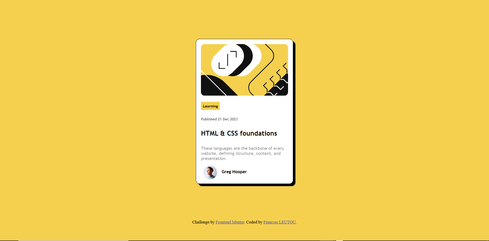

# Frontend Mentor - QR code component solution

This is a solution to the [QR code component challenge on Frontend Mentor](https://www.frontendmentor.io/challenges/qr-code-component-iux_sIO_H). Frontend Mentor challenges help you improve your coding skills by building realistic projects. 

## Table of contents

- [Overview](#overview)
  - [Screenshot](#screenshot)
  - [Links](#links)
- [My process](#my-process)
  - [Built with](#built-with)
  - [What I learned](#what-i-learned)
  - [Continued development](#continued-development)
- [Author](#author)

## Overview

### Screenshot



### Links

- [Solution](https://github.com/FrancisL0001/Blog-Preview-Card)
- [Live Site](https://blog-preview-card-seven-rose.vercel.app/)

## My process

### Built with

- Semantic HTML5 markup
- CSS custom properties
- Flexbox
- Mobile-first workflow


### What I learned

Polished my HTML and CSS based skills for building web apps. Had the opportunity to test and experiment with the box-shadow attribute in building a shadow around my box:

```css
box-shadow: 6px 6px 0px rgba(0, 0, 0, 0.991);
```

Finally understood how to position my elements as centered in a vertical sense. Used the "vh" attribute for height:

```css
height: 60vh;
```

Noticed that this gives about 60% of the vertical height available on the screen. Quite nice to use. 


### Continued development

I now look forward to creating real web apps by incorporating js or a framework into my work and perhaps moving to backend eventually. 


## Author

- Frontend Mentor - [FrancisL0001](https://www.frontendmentor.io/profile/FrancisL0001)
- GitHub - [FrancisL0001](https://www.twitter.com/yourusername) 

